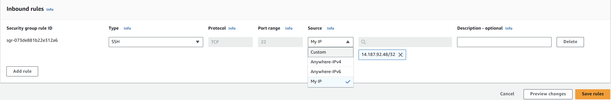

# Dùng Terraform để quản lý và triển khai hạ tầng AWS
## bước 1: Clone project về máy
## Bước 2: Chạy lệnh terraform init để khởi tạo thu mục làm việc chính
## Bước 3: Chạy lệnh terraform plan để xem trước các thay đổi mà terraform sẽ thực hiện, một kế hoạch chi tiết về các tài nguyên sẽ được hiển thị sau khi lệnh chạy thành công.
## Bước 4: chạy lệnh terraform apply để áp dụng các thay đổi và triển khai các cấu hình để có được các tài nguyên trên hạ tầng AWS.
## Bước 5: Kiểm tra các tài nguyên được cấp và SSH đến Public EC2 và từ public EC2, ta SSH đến Private EC2. Nếu thành công ở bước 5 thì đã triển khai thành công hạ tầng AWS và đáp ứng được các yêu cầu bảo mật.
## Bước 6: Sau khi chạy thành công, để tránh việc lãng phí tài nguyên nếu không sử dụng thì ta chạy lệnh terraform destroy để thu hồi các tài nguyên đã cấp.

# Lưu ý:
## Ta cần chia ra các module để dễ dàng quản lý và tái sử dụng sau này:
Ta có thể test các module này bằng cách tạo các /examples trong từng module và chạy lần lượt các lệnh terraform init và terraform plan để có thể kiểm tra xem cấu hình có hợp lệ không. Nếu ra chạy lệnh terraform plan thành công ta sẽ thấy một kế hoạch chi tiết về cấu hình triển khai (Không có tài nguyên thực vì chưa terraform apply).
## Ngoài ra ta cần lưu ý về các rules của Security Groups để đảm bảo bảo mật:
Ta có thể gán Public IP vào biến var.allowed_ssh_ip như sau

Trong file cấu hình (parent main.tf)

Trong module security groups:

 Hoặc có thể khai báo là allowed_ssh_ip = [ ] trong cấu hình, sau đó vào Public Security Group -> Inbound rules -> edit Inbound rules -> Chỉnh mục Source thành My_ip -> save rules như minh chứng sau thì mới có thể ssh đến được Public EC2(vì địa chỉ public ip luôn thay đổi nên phần này mình chưa kiểm soát được).
